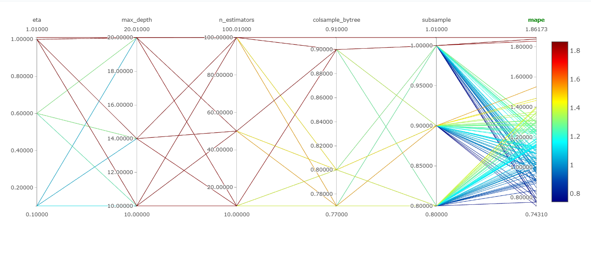
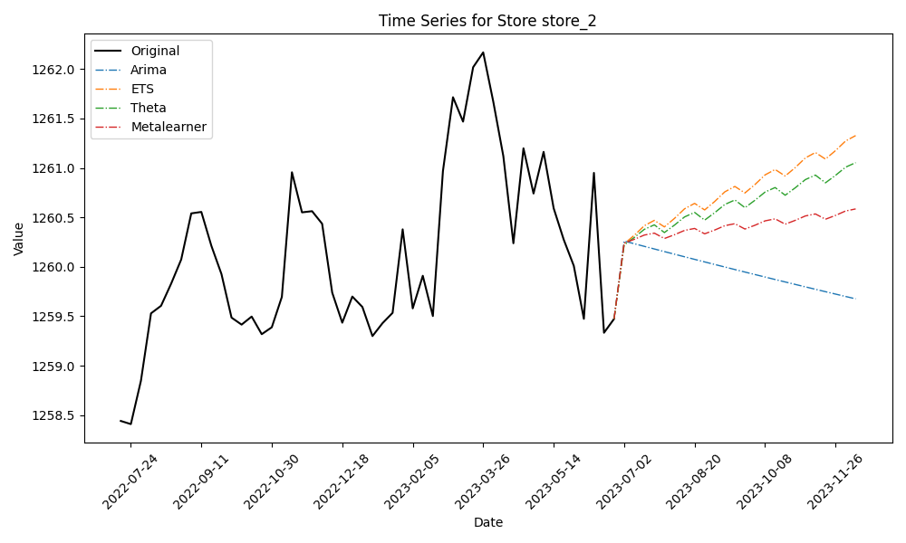
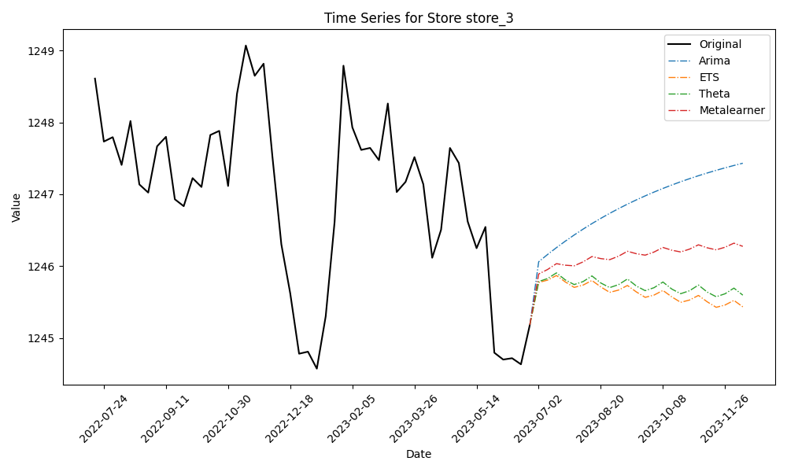
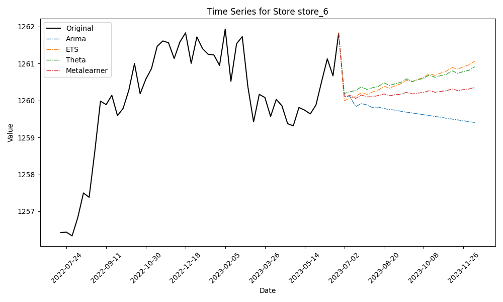

# Stochastic Time Series Analysis and Forecasting
## An ensemble learning approach
### ML Zoomcamp Capstone Project

**Javier Blanco**

Cohort 2023-2024


# Installation and Run

### Prerequisites
Anaconda or Miniconda, along with Docker, are highly recommended for installation on your local machine before executing this application. While not mandatory, these tools contribute significantly to a smoother and more efficient deployment of the application. 

### Data Structure

To run this project and test metalearner (xgboost ensemble) Time serie Datasets should adhere to the following format:

| unique_id | ds         | y                |
|-----------|------------|------------------|
| store_1   | 2019-05-05 | 1250.0           |
| store_1   | 2019-05-12 | 1250.00041666667 |
| store_1   | 2019-05-19 | 1250.06997804507 |
| store_2   | 2019-05-26 | 1250.02991280279 |
| store_2   | 2019-06-02 | 1250.14940027601 |
| store_2   | 2019-06-09 | 1250.19648033048 |
| store_3   | 2019-06-16 | 1250.30091702846 |
| store_3   | 2019-06-23 | 1250.40550119065 |
| store_3   | 2019-06-30 | 1250.49373326991 |
| store_4   | 2019-07-07 | 1250.44407862312 |
| store_4   | 2019-07-14 | 1250.70123105731 |

### Run app locally

```bash
   git clone https://github.com/jblanco89/ML_Zoomcamp_Capstone_Project.git
   cd ML_Zoomcamp_Capstone_Project
   pip install -r requirements.txt
```
```bash
# How to use main.py
   python src/main.py src/Features/all_data_ts.csv
```

## Run app with DOCKER

To facilitate the deployment of this system, it is imperative to have Docker and Docker-Compose installed on your system. An useful installation guide is available in this [link](https://github.com/DataTalksClub/mlops-zoomcamp/tree/main/01-intro)

Open a terminal or command prompt, navigate to the directory containing Dockerfile
```bash
    docker build -t your_image_name:tag .
```
and then

```bash
    docker run -p 4000:80 your_image_name:tag
```

# Table of Contents

1. [Project Approach](#project-approach)
2. [Motivation](#motivation)
3. [Synthetic Data and Time Series Dataset](#synthetic-data-and-time-series-dataset)
   1. [Stochastic Differential Equation (SDE) Object](#stochastic-differential-equation-sde-object)
   2. [Simulations Overview](#simulations-overview)
   3. [Simulation Results](#simulation-results)
4. [Technical Solution](#technical-solution)
5. [Software Tools and Models Used](#software-tools-and-models-used)
6. [Exploratory Data Analysis](#exploratory-data-analysis)
7. [Model Experiment and Final Hyperparameters](#model-experiment-and-final-hyperparameters)
8. [Results](#results)
9. [Main Conclusions](#main-conclusions)
10. [References](#references)


## Project Approach

For this project, I chose to experiment with time series forecasting methods based on `XGBoost` as an ensemble learner and other methods such as `ARIMA` `ETS`, and `Theta` as base learner models. The goal was to develop a more robust machine learning model capable of achieving superior forecasting performance. To do this I will try the [Montero-Manso et al.(2019)](https://robjhyndman.com/papers/fforma.pdf) article, titled *"FFORMA: Feature-based Forecast Model Averaging"*. Here, they proposed an automated method for obtaining `weighted forecast combinations` using **time series features**. The approach involved two phases. Firstly, a collection of time series was used to train a meta-model, assigning weights to various possible forecasting methods with the aim of minimizing the average forecasting loss from a weighted forecast combination. The inputs to the meta-model were features extracted from each series. In the second phase, new series were forecasted using a `weighted forecast combination`, where the weights were obtained from the previously `trained meta-model`. Their method outperformed a simple forecast combination and surpassed all of the most popular individual methods in the time series forecasting literature. The approach achieved the second position in the M4 competition.


## Synthetic Data and Time Series Dataset

### Stochastic Differential Equation (SDE) Object
$$
dX_t = a(b - X_t) dt + σ* \sqrt(X_t) dW_t
$$

This equation models the dynamics of a stochastic time series according to the [M10a model](Docs/), where:

- `X_t` is the stochastic variable representing the time series.
- `a` and `b` are parameters of the model.
- `σ` is another parameter of the model.
- `dW_t` is a stochastic differential, typically associated with a Wiener process or Brownian motion.


This stochastic differential equation describes how the variable `X_t` evolves over time, with a deterministic term `a(b - X_t) dt` and a stochastic term `σ sqrt(X_t) dW_t`. The presence of stochastic terms reflects randomness in the process and is characteristic of stochastic differential equations (SDEs).

### Simulations Overview

One hundred simulations have been conducted using the stochastic model with the following parameters:

- `a = 1`
- `b = 0.1`
- `sigma = 5`

These simulations aim to generate 100 datasets of time series that emulate the behavior of `weekly` sales for the past `five` years across `100` different stores. The simulations were performed using the Finance Toolbox in `MATLAB R2021b `for the Stochastic Differential Equation (SDE) model [(see here)](matlab/SDE_M10a.m). The Finance Toolbox provides tools and functions tailored for financial modeling, making it a suitable choice for capturing the complexities of sales dynamics in a retail context.

Each simulation provides insights into the stochastic dynamics of the sales process, capturing both deterministic trends and stochastic fluctuations that may resemble real-world scenarios.


### Simulation Results

The simulations of the stochastic differential equation (SDE) with the specified parameters have yielded insightful results. Four key visualizations have been constructed to analyze and interpret the behavior of the simulated time series data:

1. **Simulated Time Series:**

   

   This plot illustrates the trajectories of the stochastic process across multiple simulations. It provides an overview of the evolving behavior of the time series.

2. **First Derivative:**

   

   The first derivative plot depicts the rate of change of the simulated time series. It highlights trends and variations in the slope, offering valuable insights into the underlying dynamics.

3. **Second Derivative:**

   

   The second derivative plot further analyzes the acceleration of the simulated time series. It helps identify points of inflection and provides a deeper understanding of the system's dynamics.

4. **Density Histograms of 5 Datasets:**

   

   This composite plot showcases the density histograms of five datasets generated from the simulations. It offers a visual representation of the distribution of values within each dataset, aiding in the analysis of variability.

These visualizations collectively provide a comprehensive overview of the stochastic dynamics captured by the SDE model.

## Technical Solution

Time series forecasting using FFORMA ensemble method applying the following algorithm:

### OFFLINE PHASE: TRAIN THE LEARNING MODEL

#### Inputs:
- `{x1, x2, ..., xN}`: N observed time series forming the reference set.
- `F`: a set of functions for calculating time series features.
- `M`: a set of forecasting methods in the pool, e.g., naïve, ETS, ARIMA, etc.

#### Output:
- `FFORMA meta-learner`: A function from the extracted features to a set of M weights, one for each forecasting method.

#### Procedure:
1. **Prepare the meta-data**
    - for `n` in `1` to `N`:
        1. Split `xn` into a training period and test period.
        2. Calculate the set of features `fn` in `F` over the training period.
        3. Fit each forecasting method `m` in `M` over the training period and generate forecasts over the test period.
        4. Calculate forecast losses `Lnm` over the test period.

2. **Train the meta-learner, w**
    - Train a learning model based on the meta-data and errors, by minimizing:

      $$\arg \min_w \sum_{n=1} \left[ \sum_{m=1} w(f_n)m L_{nm} \right]$$
     
   **where**:
   
   $L_{nm}$ = MAPE Error calculated from base learners forecasting

   more info about FFORMA Loss function [see here](https://robjhyndman.com/papers/fforma.pdf)

### ONLINE PHASE: FORECAST A NEW TIME SERIES

#### Input:
- `FFORMA meta-learner` from offline phase.

#### Output:
- Forecast the new time series `xnew`.

#### Procedure:
1. for each `xnew`:
    1. Calculate features `fnew` by applying `F`.
    2. Use the meta-learner to produce `w(fnew)`, an M-vector of weights.
    3. Compute the individual forecasts of the M forecasting methods in the pool.
    4. Combine individual forecasts using `w` to generate final forecasts.


## Software Tools and Models Used

#### Time Series Analysis Models (Base Learners):

1. **AutoArima:**
   - **Description:** Automatic ARIMA model selection for time series forecasting.

2. **ETS (Exponential Smoothing State Space Model):**
   - **Description:** Framework for forecasting that includes simple exponential smoothing among its components.

3. **Theta Model:**
   - **Description:** Simple exponential smoothing model with a damping parameter (Theta) for forecasting.

#### Programming Languages:

4. **Matlab R2021a:**
   - **Description:** Used for modeling Stochastic Differential Equations (SDE) and creating synthetic time series datasets.

5. **Python 3.8.18:**
   - **Description:** Main programming language for data analysis, machine learning, and project implementation.

#### Development Environment:
6. **Anaconda (Miniconda):**
   - **Description:** Python and dependencies distribution.

#### Project Management:
7. **MLFlow:**
   - **Description:** Used for tracking experiments, packaging code into reproducible runs, and sharing and deploying models, specially tunning hyperparameter.

#### Collaborative Development:
8. **Google Colab:**
   - **Description:** Cloud-based platform for Python that allows collaborative editing of Jupyter notebooks.

#### Libraries and Frameworks:
9. **Statsmodel:**
   - **Description:** Utilized for statistical modeling and hypothesis testing, ETS and Theta models were taken from this library.

10. **pmarima:**
   - **Description:** Library for Auto-ARIMA modeling in time series analysis.

11. **scikit-learn:**
   - **Description:** Employed for various machine learning tasks, including Mean Absolute Percentage Error (MAPE) calculation.

12. **Xgboost:**
   - **Description:** Implemented for building an ensemble machine learning model (meta-learner).


## Exploratory Data Analysis

In the Exploratory data analysis (EDA), we conducted a stationary test using the Dickey-Fuller test, identified seasonality and trends, and examined the short-term (t+1) and long-term (t+10) autocorrelation functions (ACF). Despite the synthetic nature of the dataset created using a Stochastic Differential Equation (SDE) model, the EDA notebook provides valuable insights. To explore the notebook with accompanying annotations, [see here]('EDA/EDA_ML_Zoomcamp_Capstone.ipynb')   

## Model Experiment and Final Hyperparameters

After 246 runs in `MLFlow`, best xgboost hyperparameter were estimated:



```python
param_grid = {
    'n_estimators': 10,
    'max_depth': 10,
    'eta': 0.1,
    'subsample':0.90,
    'colsample_bytree': 0.77
        }
```

Minimum Absolute error calculated was `0.717 %`

## Results

The ensuing analysis of Store Time Series reveals distinct performance metrics among various models. Notably, the Metalearner model, instantiated as an Ensemble XGBoost Model, displays superior efficacy relative to the ARIMA model, although exhibiting a marginally inferior performance when compared to the Theta and ETS models. This discrepancy in performance can be attributed to the inherent capacity of both the ETS and Theta models to account for the pronounced seasonal patterns inherent in the dataset. Additionally, it is pertinent to acknowledge that all time series datasets under consideration demonstrate a stationary nature.

In spite of the prevalent stationarity, the Metalearner model demonstrates considerable utility when applied to authentic data, surpassing its performance on synthetic datasets akin to the one under examination. This underscores the adaptability and practical applicability of the Metalearner model in real-world scenarios.










The initial ten store Mean Absolute Percentage Errors (MAPEs) are presented in the next table. The Ensemble method, as introduced by the FFORMA algorithm, exhibits commendable performance in contrast to traditional forecasting approaches such as ARIMA, ETS, and Theta methods. There exists an avenue for further enrichment of the analytical framework by incorporating additional time series methodologies, including TBATS (comprising Trigonometric seasonality, Box-Cox transformation, ARMA errors, Trend, and Seasonal components) and STL (Seasonal-Trend decomposition using LOESS). Such augmentation holds promise for a more comprehensive evaluation and refinement of forecasting outcomes.


|    | Store     | Arima                  | ETS                   | Theta                  | Metalearner            |
|----|-----------|------------------------|-----------------------|------------------------|------------------------|
| 0  | store_1   | 0.001915991409945536   | 0.0025048996443828046 | 0.002270198294381479   | 0.002089571618631115   |
| 1  | store_2   | 0.0010827737729628849  | 0.0015280932400380375 | 0.00141896579630666    | 0.0012602505508671946  |
| 2  | store_3   | 0.0014680579312405307  | 0.0006195396614241023 | 0.0006625883332679433  | 0.0009426985532564415  |
| 3  | store_4   | 0.0007769552651805258  | 0.0013495201674364283 | 0.0010642672805945283  | 0.0009513189785721053  |
| 4  | store_5   | 0.0005745028193149504  | 0.0006872694724535919 | 0.0007080029283008716  | 0.000634309118598924   |
| 5  | store_6   | 0.0010627675864662261  | 0.0009859280438325884 | 0.0010209891008322244  | 0.0009949580578193654  |
| 6  | store_7   | 0.0009970341583410778  | 0.0012454924220853603 | 0.0010616885363007918  | 0.0010335418227165924  |
| 7  | store_8   | 0.0015069182063406949  | 0.0011907189331784335 | 0.0012000684587356143  | 0.0012970879456044545  |
| 8  | store_9   | 0.0019873614626923926  | 0.0026685627427830375 | 0.0024712677915031973  | 0.0023120951143911182  |
| 9  | store_10  | 0.0010998833930201599  | 0.0011973829119760523 | 0.0010476254507542824  | 0.0010376965046025297  |
| 10 | store_11  | 0.001251684059517305   | 0.0019811946140714945 | 0.0018130640014861466  | 0.0015058627049166675  |


## Main Conclusions
* All time series, with the exception of store 64 sales, exhibit
stationarity, thereby greatly facilitating the forecasting estimation process for the models under consideration: AutoArima, ETS, and Theta.

* The presence of stationarity in time series data is paramount for forecasting methodologies, as it simplifies model parameter estimation and ensures the stability of statistical properties over time, thereby promoting the reliability and suitability of the forecasting process.

* The Ensemble Learning method has demonstrated commendable efficacy in sales forecasting across all stores, even in light of the synthetic data generation through the Stochastic Differential Equation (SDE) model. Notably, its performance is quantified at approximately 0.7% in terms of absolute error percentage, contrasting favorably with the ARIMA, ETS, and Theta models, which exhibit error percentages of 1.2%, 0.5%, and 0.55%, respectively.

* Furthermore, it is strongly recommended to implement a multithreading process within this project to enhance the temporal execution efficiency of individual base learners. This optimization strategy is anticipated to yield notable improvements in computational performance, thereby fostering more expedient model training and evaluation. 


## REFERENCES

* Montero-Manso, P., Athanasopoulos, G., Hyndman, R. J., & Talagala, T. S. (2020). FFORMA: Feature-based forecast model averaging. International Journal of Forecasting, 36(1), 86-92.

* Talagala, T. S., Hyndman, R. J., & Athanasopoulos, G. (2023). Meta‐learning how to forecast time series. Journal of Forecasting, 42(6), 1476-1501.

* Neisy, A., & Peymany, M. (2011). Financial modeling by ordinary and stochastic differential equations. World Applied Sciences Journal, 13(11), 2288-2295.

* Sauer, T. (2013). Computational solution of stochastic differential equations. Wiley Interdisciplinary Reviews: Computational Statistics, 5(5), 362-371.

* Picchini, U. (2007). SDE Toolbox: Simulation and estimation of stochastic differential equations with MATLAB.