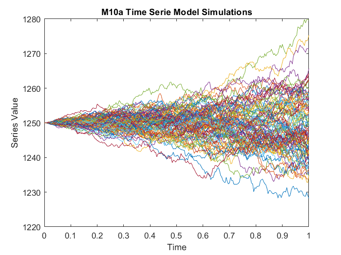
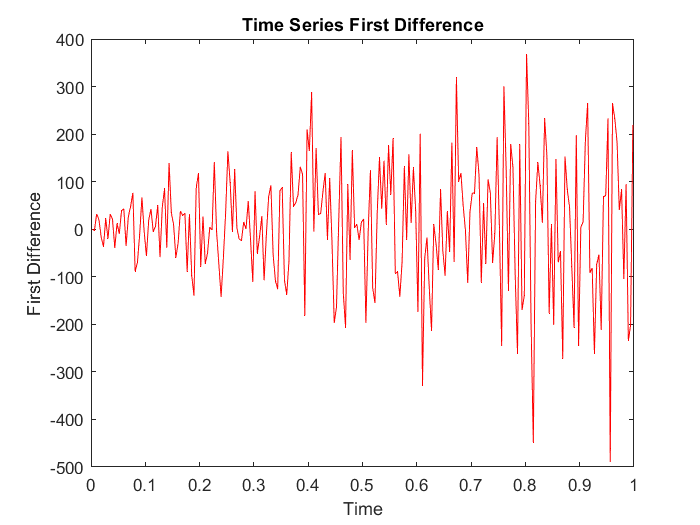
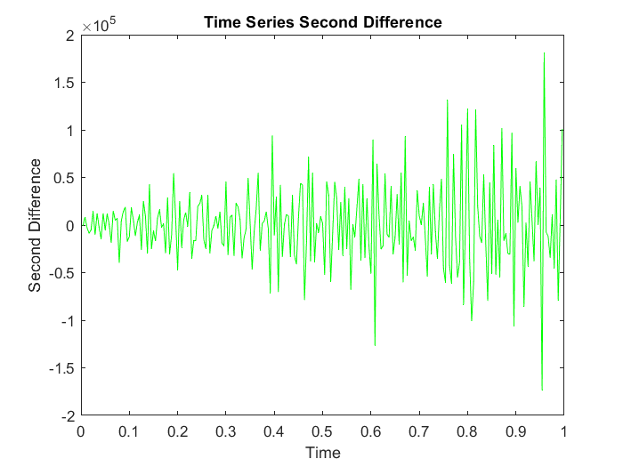
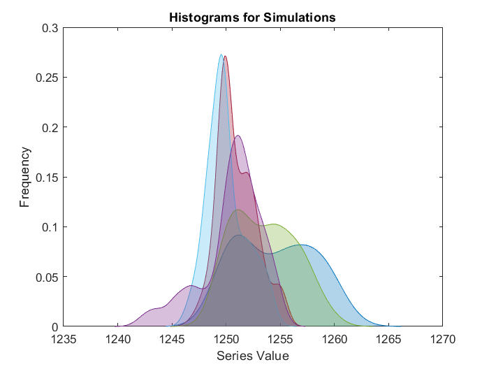

### Project Approach

For this project, I chose to experiment with time series forecasting methods based on `XGBoost` as an ensemble learner and other methods such as `ARIMA` `EST`, and `Theta` as base learner models. The goal was to develop a more robust machine learning model capable of achieving superior forecasting performance. To do this I will try the [Montero-Manso et al.(2019)](https://robjhyndman.com/papers/fforma.pdf) article, titled *"FFORMA: Feature-based Forecast Model Averaging"*. Here, they proposed an automated method for obtaining `weighted forecast combinations` using **time series features**. The approach involved two phases. Firstly, a collection of time series was used to train a meta-model, assigning weights to various possible forecasting methods with the aim of minimizing the average forecasting loss from a weighted forecast combination. The inputs to the meta-model were features extracted from each series. In the second phase, new series were forecasted using a `weighted forecast combination`, where the weights were obtained from the previously `trained meta-model`. Their method outperformed a simple forecast combination and surpassed all of the most popular individual methods in the time series forecasting literature. The approach achieved the second position in the M4 competition.

### Stochastic Differential Equation (SDE) Object
$$
dX_t = a(b - X_t) dt + σ* \sqrt(X_t) dW_t
$$

This equation models the dynamics of a stochastic time series according to the [M10a model](Docs/), where:

- `X_t` is the stochastic variable representing the time series.
- `a` and `b` are parameters of the model.
- `σ` is another parameter of the model.
- `dW_t` is a stochastic differential, typically associated with a Wiener process or Brownian motion.

This stochastic differential equation describes how the variable `X_t` evolves over time, with a deterministic term `a(b - X_t) dt` and a stochastic term `σ sqrt(X_t) dW_t`. The presence of stochastic terms reflects randomness in the process and is characteristic of stochastic differential equations (SDEs).

### Simulations Overview

One hundred simulations have been conducted using the stochastic model with the following parameters:

- `a = 1`
- `b = 0.1`
- `sigma = 5`

These simulations aim to generate 100 datasets of time series that emulate the behavior of `weekly` sales for the past `five` years across `100` different stores. The simulations were performed using the Finance Toolbox in `MATLAB R2021b `for the Stochastic Differential Equation (SDE) model [(see here)](matlab/SDE_M10a.m). The Finance Toolbox provides tools and functions tailored for financial modeling, making it a suitable choice for capturing the complexities of sales dynamics in a retail context.

Each simulation provides insights into the stochastic dynamics of the sales process, capturing both deterministic trends and stochastic fluctuations that may resemble real-world scenarios.

### Simulation Results

The simulations of the stochastic differential equation (SDE) with the specified parameters have yielded insightful results. Four key visualizations have been constructed to analyze and interpret the behavior of the simulated time series data:

1. **Simulated Time Series:**

   

   This plot illustrates the trajectories of the stochastic process across multiple simulations. It provides an overview of the evolving behavior of the time series.

2. **First Derivative:**

   

   The first derivative plot depicts the rate of change of the simulated time series. It highlights trends and variations in the slope, offering valuable insights into the underlying dynamics.

3. **Second Derivative:**

   

   The second derivative plot further analyzes the acceleration of the simulated time series. It helps identify points of inflection and provides a deeper understanding of the system's dynamics.

4. **Density Histograms of 5 Datasets:**

   

   This composite plot showcases the density histograms of five datasets generated from the simulations. It offers a visual representation of the distribution of values within each dataset, aiding in the analysis of variability.

These visualizations collectively provide a comprehensive overview of the stochastic dynamics captured by the SDE model. The insights gained from these plots contribute to a better understanding of the system's behavior over time.
